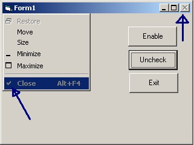

<div align="center">

## How to Disable System Menues\.


</div>

### Description

To disable form's system menues.(close,Min,Max)
 
### More Info
 


<span>             |<span>
---                |---
**Submitted On**   |2002-07-19 16:36:18
**By**             |[Girish Patil](https://github.com/Planet-Source-Code/PSCIndex/blob/master/ByAuthor/girish-patil.md)
**Level**          |Intermediate
**User Rating**    |4.0 (16 globes from 4 users)
**Compatibility**  |VB 6\.0
**Category**       |[Custom Controls/ Forms/  Menus](https://github.com/Planet-Source-Code/PSCIndex/blob/master/ByCategory/custom-controls-forms-menus__1-4.md)
**World**          |[Visual Basic](https://github.com/Planet-Source-Code/PSCIndex/blob/master/ByWorld/visual-basic.md)
**Archive File**   |[How\_to\_Dis1080377192002\.zip](https://github.com/Planet-Source-Code/girish-patil-how-to-disable-system-menues__1-37062/archive/master.zip)

### API Declarations

```
Private Declare Function GetSystemMenu Lib "user32" ( _
     ByVal hwnd As Long, ByVal bRevert As Long) As Long
   Private Declare Function GetMenuItemInfo Lib "user32" Alias _
     "GetMenuItemInfoA" (ByVal hMenu As Long, ByVal un As Long, _
     ByVal b As Boolean, lpMenuItemInfo As MENUITEMINFO) As Long
   Private Declare Function SetMenuItemInfo Lib "user32" Alias _
     "SetMenuItemInfoA" (ByVal hMenu As Long, ByVal un As Long, _
     ByVal bool As Boolean, lpcMenuItemInfo As MENUITEMINFO) As Long
   Private Declare Function SendMessage Lib "user32" Alias _
     "SendMessageA" (ByVal hwnd As Long, ByVal wMsg As Long, _
     ByVal wParam As Long, lParam As Any) As Long
```


